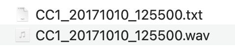
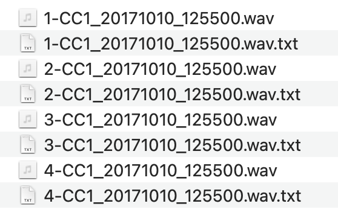

Split WAVE audio based on selection table
================
[Andrew Schwenke](https://github.com/andrew-1234/)
29 October 2022

This is a small example workflow using the
[warbleR](https://cran.r-project.org/package=warbleR) and
[RRaven](https://cran.r-project.org/package=Rraven) packages. It takes a
WAVE file and Raven selection table as input, and returns one WAVE file
(`.wav`) for each selection, as well as one Raven selection table
(`.txt` file) per selection. The practice data (CC1_20171010_125500.wav)
is an audio recording taken at Cedar Creek, south-east Queensland,
Australia, and released by Andrew Schwenke under a CC BY 4.0 license.

**Input:**



**Output:**



## Prepare the data

``` r
library(warbleR)
library(Rraven)
library(dplyr)
```

``` r
# with no file tag added, set name from file to true, and provide upper or lower WAV extension format
rvn.dat.1 <-
        imp_raven(
                all.data = TRUE,
                path = "data/typical/",
                name.from.file = TRUE,
                ext.case = "lower"
        )

# rename columns to use with warbler
rvn.dat.2 <-
        rvn.dat.1 %>%
        dplyr::rename(
                selec = Selection,
                start = `Begin Time (s)`,
                end = `End Time (s)`
        )

# generate a selection table
rvn.dat.st <- selection_table(rvn.dat.2, path = "data/typical/")
```

    ## checking selections (step 1 of 2):

``` r
check_sels(rvn.dat.st, path = "data/typical/")
```

    ## all selections are OK

## Generate segmented WAVE files

Margin is the time in seconds to add to generated WAVE files
before/after each selection. Margin = 0 would generate WAVEs that are
exactly the length of the selection annotations.

``` r
margin <- 2
cut_sels(
        X = rvn.dat.st,
        path = "data/typical/",
        mar = margin,
        dest.path = "output/cuts/typical"
)
```

``` r
# check if Delta time (s) exists
# create if it doesn't
# modify data frame to reflect what will be the new start and end times for each selection when the WAVE is split 
if(!"Delta Time (s)" %in% colnames(rvn.dat.2))
{
        rvn.dat.3 <-
                rvn.dat.2 %>% dplyr::mutate(`Delta Time (s)` = end - start)
        
        rvn.dat.4 <-
                rvn.dat.3 %>% dplyr::mutate(start = 0 + margin,
                                            end = (start + `Delta Time (s)`))
} else {
        rvn.dat.4 <-
                rvn.dat.2 %>% dplyr::mutate(start = 0 + margin,
                                            end = (start + `Delta Time (s)`))
}
```

## Generate individual selection tables for each cut WAVE

``` r
# list the cut WAVE files you generated
cut_wavs <-
        list.files(path = "output/cuts/typical/", pattern = ".wav")
```

``` r
# generate selection tables
for (x in 1:length(rvn.dat.4$selec)){
exp_raven(X = rvn.dat.4[x,], path = "output/cuts/typical/", file.name = cut_wavs[x])
}
```
